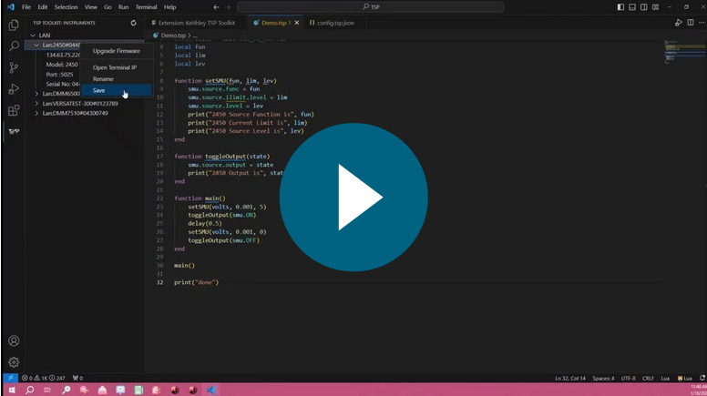

# Tektronix TSP™ Toolkit

This is an open source project from Tektronix. We welcome
any [feedback][tsp-toolkit-issues] on the GitHub repo for this project.

Tektronix TSP™ Toolkit is a comprehensive [Visual Studio Code][code] extension that provides rich
support for Test Script Processor ([TSP][tsp]) technology to enhance productivity when working with
TSP-enabled Tektronix and Keithley instruments. This toolkit delivers a complete development environment with:

* **Instrument Discovery & Management** - Discover and manage available instruments on your local network with an intuitive tree view.
* **Intelligent Code Editing** - Syntax highlighting, error detection, code navigation, and completion suggestions for TSP scripts.
* **Hover Help** - Access detailed information on individual commands such as definition,
  accepted parameters, and usage examples.
* **Command Interface** - Send commands and interact directly with your instruments
  through the integrated terminal.
* **Instrument Firmware Upgrade** - Remotely upgrade the instrument firmware directly from the VS Code interface.
* **Script Debugging** - On-instrument debugging with breakpoints, step execution, and variable inspection.
* **[Beta] Automated Script Generation** - Configuration-driven interface to create TSP scripts without manual coding.
* **System Configuration Management** - Support for TSP-Link™ networks and multi-instrument setups.

## Quick Start

- **Step 1.** Connect your TSP-enabled Tektronix and Keithley instrument to your local network (LAN).
- **Step 2.** Install the [Tektronix TSP Toolkit Visual Studio Code Extension][tsp-toolkit-marketplace].
- **Step 3.** Open or create a folder for your TSP project.

    ![Open Folder][pic-open-folder]

- **Step 4.** Access the TSP Toolkit by clicking on the TSP icon in the Activity Bar.
- **Step 5.** Connect to your instrument using one of these methods:
   - Use the Instrument Explorer to discover instruments on your network and connect by clicking the play button (▶️)
   - Click the "+" button in the Instrument Explorer to connect via IP address or VISA resource string
   - Use the Command Palette (Ctrl+Shift+P) and run "TSP: Connect"
- **Step 6.** [Configure your project](#configure-your-project) for your [TSP-Link™][tsp-link] instrument configuration.
- **Step 7.** Edit and run your TSP scripts by right-clicking them in the file explorer,
              file tabs, or editor window and selecting "Send Script to Terminal"

    ![Send Script to Terminal][pic-send-script-to-terminal]

## Demo Video

<a href="https://www.tek.com/en/video/product-demo/leveraging-test-script-processor-technology-with-keithley-tsp-toolkit"></img></a>

## TSP View Container

TSP Toolkit provides a dedicated view container in the Activity Bar that offers access to all major features:

### View Sections

- **Instruments**: Displays discovered and saved instruments on your network.
  - Connect to instruments.
  - Manage instrument connections.
  - Perform instrument operations (reset, abort, firmware upgrade).

- **System Configurations**: Configure your TSP-Link instrument network.
  - Create new system configurations.
  - Fetch configurations from connected instruments.
  - Switch between different configurations.

- **[Beta] Script Generation**: Create and manage TSP scripts without manual coding.
  - Create new script generation sessions.
  - Access saved script configurations.
  - Generate ready-to-use TSP scripts.

### Accessing the View

Click the TSP Toolkit icon  in the Activity Bar (usually on the left side of VS Code) to access all these features.

## Working with Instruments

### Instrument Explorer

The Instrument Explorer provides an intuitive interface for discovering, connecting to, and managing your TSP-enabled instruments.

#### Key Features

- **Auto-Discovery**: Automatically find TSP instruments on your local network.
- **Manual Connection**: Connect to instruments via IP address or VISA resource string.
- **Instrument Management**: Save, rename, and remove instruments from your list.
- **Firmware Upgrade**: Upgrade instrument firmware directly from the explorer interface.
- **Terminal Integration**: Open terminal connections to instruments with a single click.
- **Reset & Abort**: Control instrument state with reset and abort functions.

### Terminal Usage

When connected to an instrument, you interact with it through the integrated terminal:

- **Direct Command Execution**: Type TSP commands directly in the terminal and press Enter to execute them.
- **Terminal Commands**: The terminal supports special commands prefixed with a period (`.`). Here are the most important ones:
  - `.help` - Display available terminal commands.
  - `.exit` - Properly close the terminal connection (recommended over using the trash icon).
  - `.reset` - Reset the connected instrument.
  - `.abort` - Abort the current operation on the instrument.

#### Usage Notes

When running scripts or commands via the terminal, errors are only fetched _after_ the
requested action completes. No new errors will be printed while the operation is in
progress.

## Working with TSP Scripts

### Running Scripts

To execute your TSP scripts on connected instruments, you can perform one of the following:

1. Right-click a TSP file in the explorer or editor and select "Send Script to Terminal"
2. Click the Run icon in the editor title bar when a TSP file is open

### [Beta] Automated TSP Script Generation

The Automated TSP Script Generation is a powerful feature that allows you to create TSP scripts through a graphical interface without needing to write code manually.

> ⚠️**Warning**
> The Automated TSP Script Generation feature is currently in beta. If you encounter issues, please let us know so we can improve it.

> ℹ️**Note:** 
> System configuration must be completed before using the Automated TSP Script Generation feature, as channel IDs are populated based on your configured system.

#### Using the Automated TSP Script Generation

1. First, [configure your project](#configure-your-project) for your instrument system.
2. Open the TSP Toolkit view container from the Activity Bar.
3. Locate the **SCRIPT GENERATION** section.
4. Click the "+" button and enter a name for your script.
5. Configure your test parameters in the webview interface.
6. Click **Open Script** to generate and view your TSP script.
7. The generated script will appear in a side pane for further editing or execution.

#### Managing Script Generation Sessions

- **Save Sessions**: Your script generation configurations are automatically saved and can be accessed again later.
- **Delete Sessions**: Click the delete icon next to a saved session to remove it from your list.
- **Edit Sessions**: Click on a saved session to reopen and modify it.

### TSP Script Debugging

The TSP Toolkit includes a powerful on-instrument debugging capability that allows you to debug your TSP scripts directly on the connected instrument.

#### Using the TSP Debugger

1. Open a TSP script file in the editor.
2. Set breakpoints by clicking in the gutter next to line numbers.
3. Start debugging by:
   - Using the Run and Debug view (Ctrl+Shift+D)
   - Using the Command Palette and running "TSP: Debug TSP File".
   - Click the debug icon in the editor title bar.
4. Use the debug controls to step through your code, inspect variables, and view the call stack.

#### Debug Features

- **Breakpoints**: Set breakpoints in your TSP code to pause execution at specific points.
- **Variable Inspection**: View and monitor variable values during script execution.
- **Watch Expressions**: Add custom expressions to the watch panel to track specific variable values or evaluate expressions as your script runs.
- **Call Stack**: Navigate the execution call stack to understand the flow of your code.
- **Step Controls**: Step into, step over, and step out of functions during debugging.

## System Configuration

### Configure Your Project

There are two ways to configure your project to have language features for your TSP-Link
node network: Automatic or Manual.
After completing either method, you will be shown relevant code completion suggestions,
signature help, and documentation for the instruments in your TSP-Link network.

#### Automatic Configuration

If you are already connected to a physical instrument with your TSP-Link network configured,
then it is possible to have TSP Toolkit automatically configure your project for you.

1. Open any workspace folder in VSCode.
2. Connect to your instrument using the discovery pane or the `TSP: Connect` command.
3. Open the side bar by clicking the TSP Toolkit icon in the Activity Bar (usually on the left side of VSCode).
4. In the TSP Toolkit side pane, expand the **SYSTEM CONFIGURATIONS** section.
5. Click the **Fetch connected instrument and its TSP-Link nodes** icon.
6. Enter a name for the new system when prompted.

#### Manual Configuration

1. Open any workspace folder in VSCode.
2. Open the side bar by clicking the TSP Toolkit icon in the Activity Bar (usually on the left side of VSCode).
3. In the TSP Toolkit side pane, expand the **SYSTEM CONFIGURATIONS** section.
4. Click the **Add new System** icon.
5. Enter the required system details and save.

## Command Reference

### Common Commands

Open the Command Palette (<kbd>Cmd</kbd>+<kbd>Shift</kbd>+<kbd>P</kbd> on macOS and
<kbd>Ctrl</kbd>+<kbd>Shift</kbd>+<kbd>P</kbd> on Windows or Linux), then type one of the
following commands:

| Command                          | Description                                                                         | 
|:---------------------------------|:------------------------------------------------------------------------------------|
| TSP: Connect                     | Opens a new terminal session to an instrument (be sure to close with `.exit`, see the [Known Issues](#known-issues) section below) |
| TSP: Debug TSP File              | Start debugging the current TSP file on the connected instrument                    |
| TSP Toolkit: Focus on Script Generation View   | Open the Automated TSP Script Generation interface                               |

To see all available Tektronix TSP Toolkit commands, open the Command Palette and type `TSP`.

### Context Menu Options

Right-click on your active editor window while a `*.tsp` file is open to access:

| Context-Sensitive Option     | Description                                                                                   |
|:-----------------------------|:----------------------------------------------------------------------------------------------|
| Send Script to Terminal      | Send the current script to the currently connected instrument                                 |

## Resources and Documentation

### Installed Extensions

Tektronix TSP Toolkit will automatically install the [sumneko.lua][sumneko]
extension to use all of the language features it provides.

Extensions installed through the marketplace are subject to the [Marketplace Terms of Use][marketplace-tou].

### Learning Resources

- [TSP Toolkit Feature Walkthrough][tsp-toolkit-feature-walkthrough]
- [TSP Landing Page on Tek.com][tsp]
- [TSP Video Series][tsp-video-series]
- [App Note: How to Write TSP Scripts for TSP][app-note-how-to-write-tsp-scripts]
- [TSP Script Example Repository][tsp-script-examples]

### Supported Locales

The extension is currently only available in English.

## Questions, Issues, Feature Requests, and Contributions
- If you come across a problem with the extension, please file an [issue][tsp-toolkit-issues].
- Any and all feedback is appreciated and welcome!
    - If someone has already filed an [issue][tsp-toolkit-issues] that encompasses your
      feedback, please leave a 👍/👎 reaction on the issue. Otherwise please start a new
      [discussion][tsp-toolkit-discussions]
- If on Windows, you must have [Microsoft Visual C++ Redistributable](https://learn.microsoft.com/en-us/cpp/windows/latest-supported-vc-redist?view=msvc-170). Please ensure you have this installed.

## Known Issues

We are constantly working to improve the stability and reliability of this software. Here
are the known issues that we are working to fix.  If you come across new issues,
please let us know! See the [next section](#questions-issues-feature-requests-and-contributions)
for more information.

- Due to limitations in instrument firmware, script names longer than 27 characters will
  be truncated to 27 characters. If multiple scripts have names that are the same up to
  the 27th character, the second script will overwrite the first.
- Some instruments (2450, 2460, 2461, 2470, DAQ6500, DMM7510, 3706A, 707B, 708B) encounter
  a fatal error if the trash can is used to close the connected terminal if the instrument
  is connected via GPIB on VISA. Be sure to type `.exit` when connected to one of these
  instruments over GPIB.
- The list of instruments that support language features is limited to the following:
    - 2450
    - 2460
    - 2461
    - 2470
    - 2601B
    - 2601B-PULSE
    - 2602B
    - 2604B
    - 2611B
    - 2612B
    - 2614B
    - 2634B
    - 2635B
    - 2636B
    - 2651A
    - 2657A
    - DMM7510
    - MP5103
- Upgrading firmware on the 3706A, 707B, and 708B instruments is not successful. This will NOT
  render the instrument inoperable, but will not complete successfully.
- Instrument discovery might not work for 2600-series and 3706A due to firmware limitation.

<!--Refs-->
[app-note-how-to-write-tsp-scripts]: https://www.tek.com/en/documents/application-note/how-to-write-scripts-for-test-script-processing-(tsp)
[code]: https://code.visualstudio.com/
[marketplace-tou]: https://cdn.vsassets.io/v/M146_20190123.39/_content/Microsoft-Visual-Studio-Marketplace-Terms-of-Use.pdf
[sumneko]: https://marketplace.visualstudio.com/items?itemName=sumneko.lua
[tsp-link]: https://www.tek.com/en/video/product-features/what-is-tsp-link
[tsp-script-examples]: https://github.com/tektronix/keithley/
[tsp-toolkit-feature-walkthrough]: https://www.tek.com/en/documents/application-note/harness-the-power-of-tsp-toolkit-software
[tsp-toolkit-marketplace]: https://marketplace.visualstudio.com/items?itemName=Tektronix.tsp-toolkit
[tsp-toolkit]: https://www.tek.com/software/tsp-toolkit-scripting-tool
[tsp-toolkit-issues]: https://github.com/tektronix/tsp-toolkit/issues
[tsp-toolkit-contributing]: ./CONTRIBUTING.md
[tsp-toolkit-discussions]: https://github.com/tektronix/tsp-toolkit/discussions
[tsp-toolkit-dev-process]: ./CONTRIBUTING.md#development-process
[tsp-video-series]: https://www.youtube.com/@tektronix/search?query=TSP
[tsp]: https://www.tek.com/en/solutions/application/test-automation/tsp-for-test-automation

<!--Pics-->
[pic-send-script-to-terminal]: https://github.com/tektronix/tsp-toolkit/blob/main/images/SendScriptToTerminal.png?raw=true
[pic-open-folder]: https://github.com/tektronix/tsp-toolkit/blob/main/images/OpenFolder.png?raw=true
